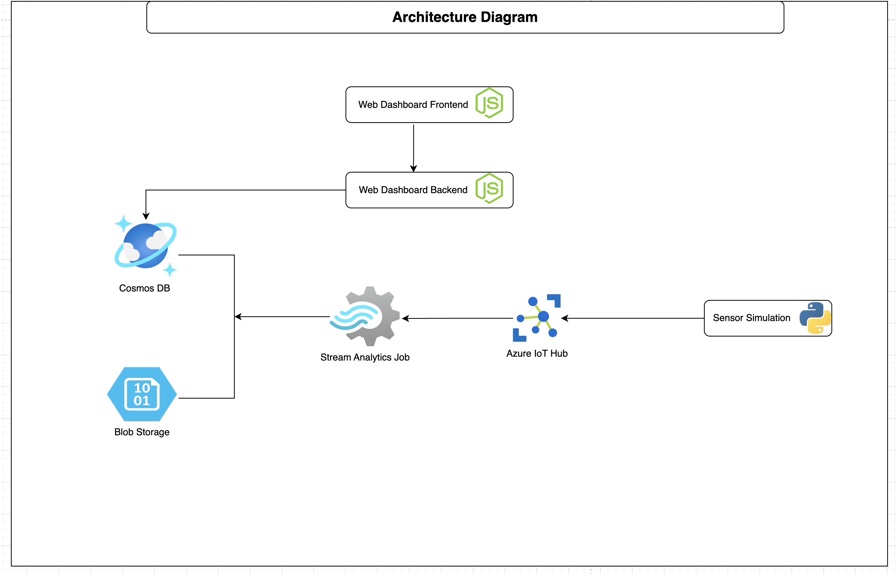
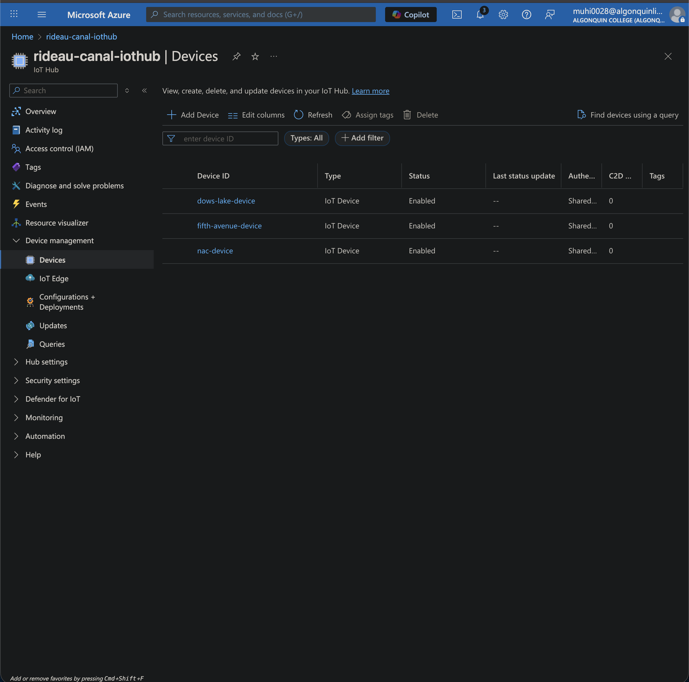
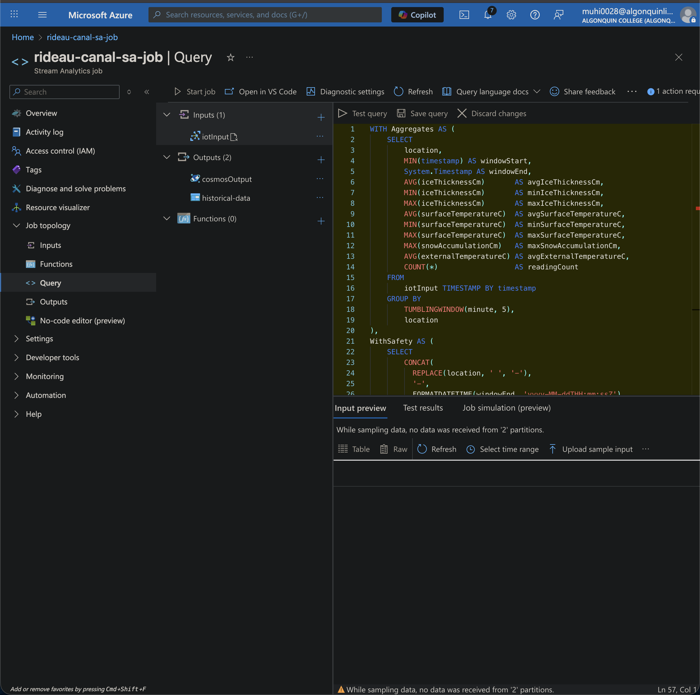
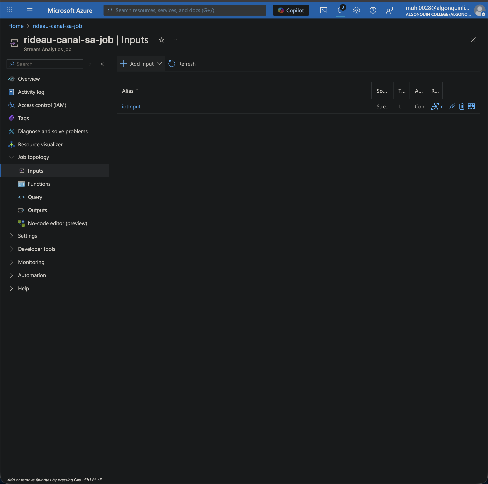
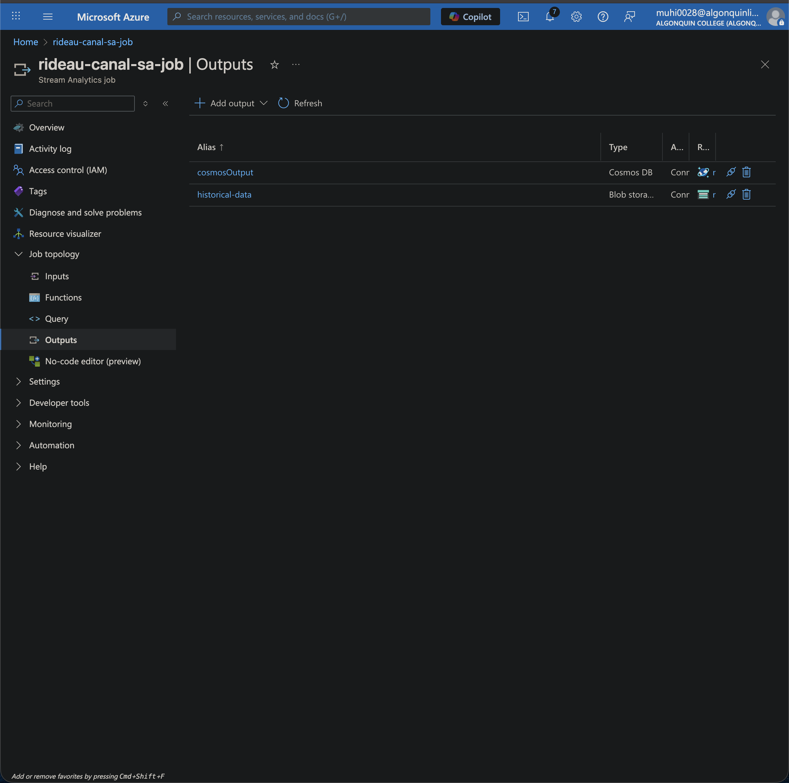
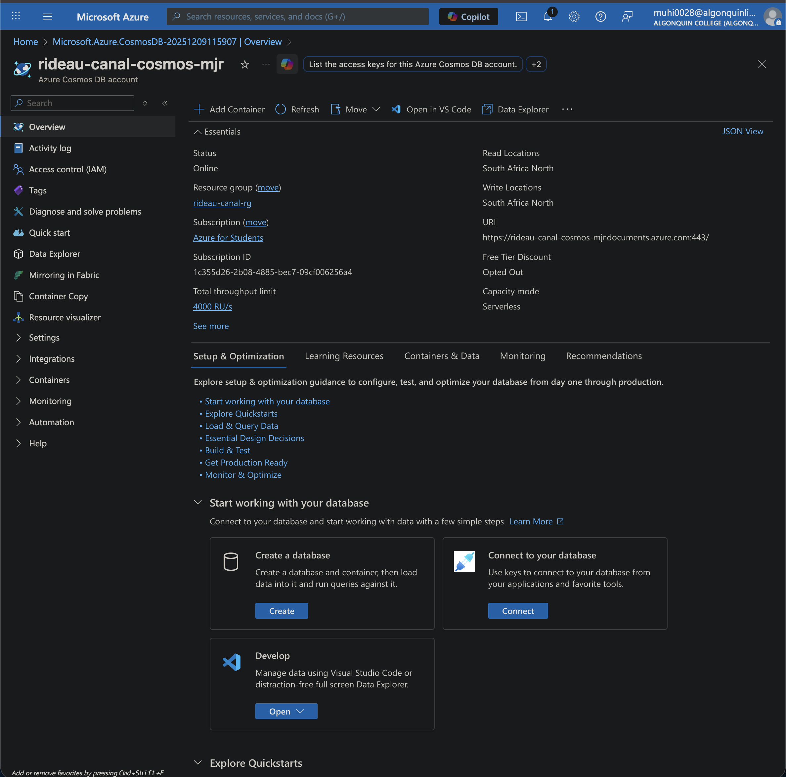
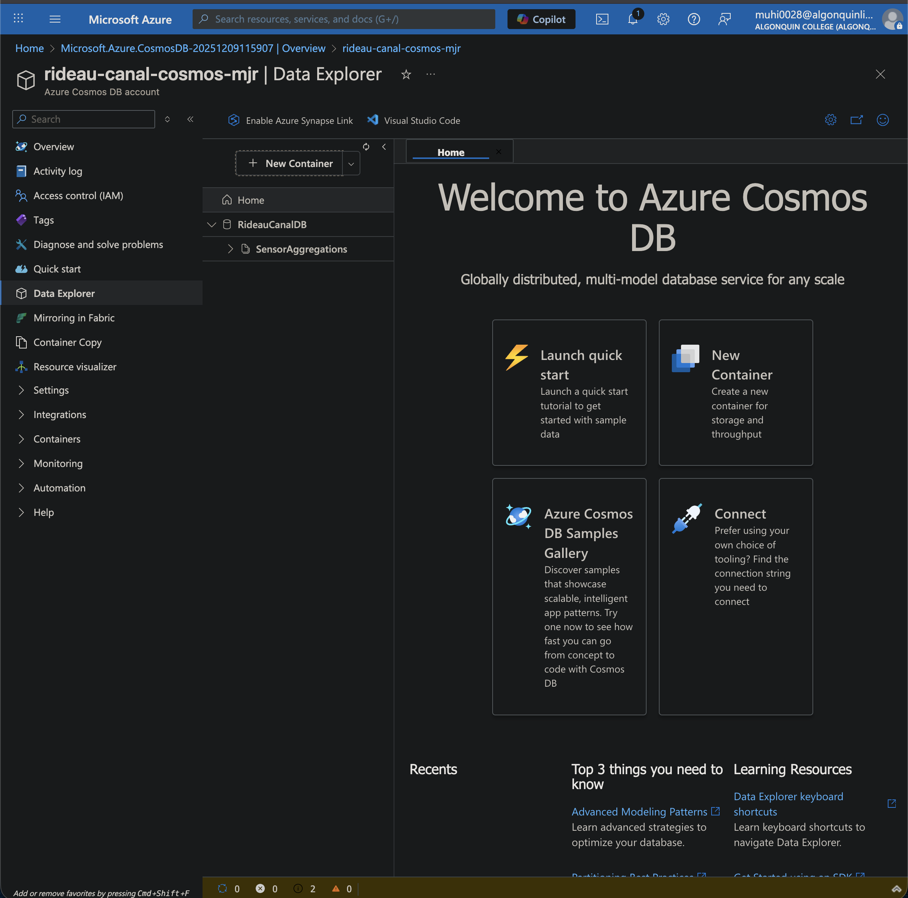
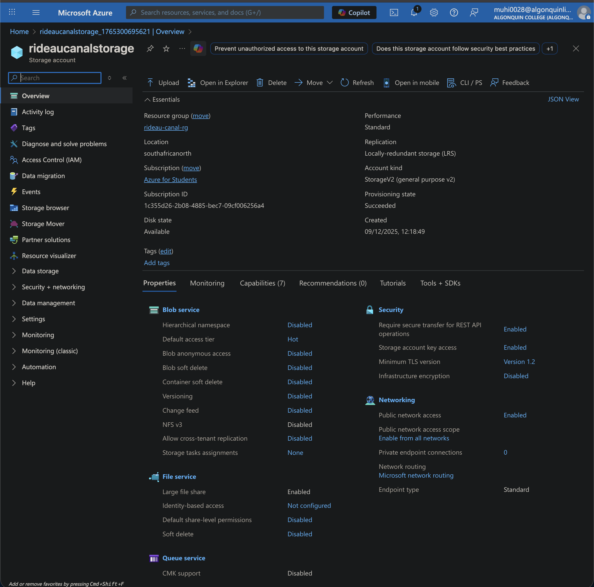
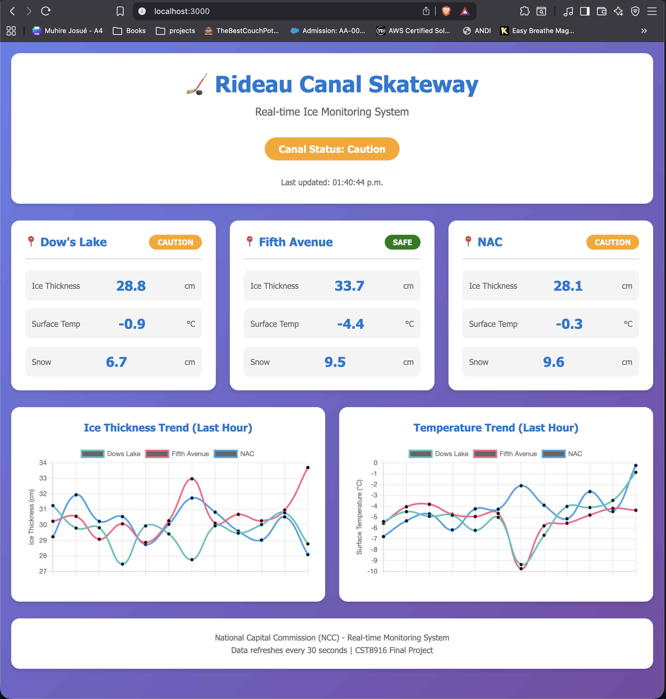

# Rideau Canal Real-Time Ice Monitoring System

**CST8916 – Final Project**  
**Student:** *Muhire Rutayisire*  
**Student ID:** *41193051*

This project implements an end-to-end IoT analytics pipeline for monitoring ice safety conditions across the Rideau Canal Skateway. Live sensor readings are ingested through Azure IoT Hub, processed with Stream Analytics, stored in Cosmos DB, archived to Blob Storage, and visualized in a custom real-time dashboard.

This project implements an end-to-end IoT analytics pipeline for monitoring ice safety conditions across the Rideau Canal Skateway. Live sensor readings are ingested through Azure IoT Hub, processed with Stream Analytics, stored in Cosmos DB, archived to Blob Storage, and visualized in a custom real-time dashboard.

---

## 📌 Repository Links

- **Sensor Simulation:** https://github.com/Muhire-Josue/rideau-canal-sensor-simulation  
- **Web Dashboard:** https://github.com/Muhire-Josue/25F_CST8916_Final_Project_Web-Dashboard
- **Video Demo:** https://youtu.be/your-video-placeholder  

All required screenshots and architecture references are located in the `/screenshots` and `/architecture` folders of this repository.

## 📘 1. Scenario Overview

The National Capital Commission (NCC) requires an automated system to evaluate ice safety along three critical locations:

- **Dows Lake**
- **Fifth Avenue**
- **NAC**

The system must:

- Collect frequent temperature, snow, and ice-depth readings  
- Aggregate data every 5 minutes  
- Determine safety status  
- Store historical readings  
- Provide a real-time dashboard for public visibility  

This project delivers a full Azure-based implementation of that workflow.

## 🏗️ 2. System Architecture

### Components Used
- **Azure IoT Hub:** Ingests telemetry from three simulated sensors  
- **Azure Stream Analytics:** Performs 5-minute window aggregations and safety classification  
- **Azure Cosmos DB:** Stores the latest processed readings  
- **Azure Blob Storage:** Archives all window outputs for historical analysis  
- **Azure App Service (optional):** Hosts the dashboard in the cloud  
- **Node.js Dashboard:** Visualizes real-time and historical data  

### Data Flow Summary
1. Python simulator sends telemetry to **IoT Hub**  
2. **Stream Analytics** aggregates data every 5 minutes  
3. Aggregates are written to **Cosmos DB** for the dashboard  
4. Full results are exported to **Blob Storage** for archival  
5. Dashboard fetches data from a small Node.js API  

## ⚙️ 3. Implementation Overview

### **IoT Sensor Simulation**  
- Three virtual sensors: Dows Lake, Fifth Avenue, NAC  
- Randomized but realistic values for temperature, snow, and ice thickness  
- Sends messages to IoT Hub using MQTT  
- Repository: *rideau-canal-sensor-simulation*

### **IoT Hub Configuration**
- 3 registered devices  
- Shared key authentication  
- Free tier (8,000 msg/day)  

### Screenshot:

### **Stream Analytics Job**
- Input: IoT Hub  
- Outputs:
  - Cosmos DB (`cosmosOutput`)
  - Blob Storage (`historical-data`)

### Screenshot:

The full query is stored in `/stream-analytics/query.sql`.

### **Cosmos DB**
- Container: **SensorAggregations**  
- Stores latest windowed results  
- Partition key: `/location`  

### Screenshot:

### **Blob Storage**
- Container: `historical-data`  
- Automatically stores JSON files created each 5-minute window  

### Screenshot:

### **Web Dashboard**
- Node.js + Express backend  
- Static HTML/CSS/JS frontend  
- Calls API endpoints:
  - `/api/latest`
  - `/api/history/:location`
  - `/api/status`

Features:
- Real-time updates every 30 seconds  
- Ice thickness and temperature trend charts  
- Safety classification badges  

### Screenshot:

Repository: https://github.com/Muhire-Josue/25F_CST8916_Final_Project_Web-Dashboard

## 📊 4. Results & Observations

- Stream Analytics produced consistent 5-minute aggregates  
- Cosmos DB displays correct last-window measurements for all locations  
- Dashboard successfully auto-refreshes and updates charts  
- Blob Storage receives archived results exactly as expected  
- Safety classification logic correctly identifies:
  - *Safe*
  - *Caution*
  - *Unsafe*  

Overall, the pipeline functioned reliably in real time throughout testing.

## 🧩 5. Challenges & Solutions

| Challenge | Solution |
|----------|----------|
| Stream Analytics timestamps differed from expected field names | Aligned simulation payload schema with query input requirements |
| Aggregated data missing due to incorrect grouping | Added `TUMBLINGWINDOW` with grouping by location |
| Dashboard charts showing "Invalid Date" | Corrected JSON field name to `windowEnd` and reformatted timestamps |
| Cosmos DB access issues | Switched to primary key and validated permissions |

## 🤖 6. AI Tools Disclosure

**AI Tools Used:** ChatGPT  
**Purpose:** Debugging Node.js errors, fixing Stream Analytics query syntax, formatting documentation, improving dashboard logic.  
**Extent:** Code was verified, modified, and fully understood before inclusion. Final implementation reflects my own understanding and adjustments.  
**Restrictions Followed:** No generated code was used blindly; all components were tested and validated manually.

